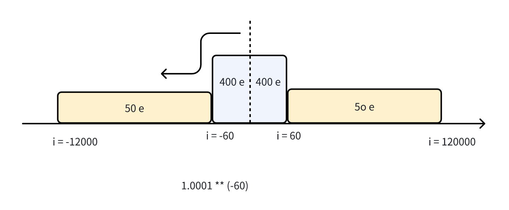

## LamboV2: An Efficient, Near-Zero Cost Liquidity Solution for Token Launch

In the realm of cryptocurrency, liquidity is paramount, especially for nascent Meme projects. Liquidity refers to the ease with which assets can be bought or sold in the market without affecting their price. For cryptocurrency projects, having sufficient liquidity is crucial for several reasons.

To search for an efficient, near-zero cost liquidity solution for token launch, we propose a straightforward mechanism: the concept of virtual liquidity to meet the liquidity needs of project parties. We will establish a deep liquidity pool on Curve to satisfy the liquidity exit for users' buying and selling activities. Essentially, this mechanism involves whales providing liquidity to retail investors. Liquidity providers can earn profits through LP fees, creating a win-win situation where whales earn LP fees and retail investors/developers resolve their liquidity issues.

We believe this mechanism can enhance the liquidity returns for DeFi whales while simultaneously addressing the liquidity challenges faced by retail investors and developers.

## Virtual Liquidity
Virtual liquidity is a conditional ERC20 token. For each holder address of virtual liquidity, the transferable balance must satisfy the following formula to ensure that the issued virtual liquidity does not enter the market.

```
transferable_balance = balance - debt
```
where Debt is always less than or equal to the balance.

## Franework

This is the core contract of Lambo.win:
1. VirtualToken
2. LamboFactor
3. LamboRouter


## Peg And Repeg

We will deploy liquidity on Uniswap V3, and the `LamboRebalanceOnUniwap` contract is responsible for rebalancing the Uniswap V3 pool. The Rebalance contract utilizes the flash loan mechanism to perform arbitrage operations through MorphoVault. Specifically, the Rebalance contract executes buy or sell operations in the Uniswap V3 pool to ensure the pool's balance and gain profit through arbitrage.


In Uniswap V3, Lambo's LP needs to have two ranges:
1. Peg Zone
2. Repeg Zone

The Peg Zone is designed to allow low slippage exchanges between vETH and ETH. The purpose of the Repeg Zone is to create slippage, allowing the Rebalance contract to trigger timely rebalancing with profit margins to subsidize LP fees, thereby enabling cost-free flash loans.


## Acknowledged Detail

1. Rebalance Contract ignore gas cost

The RebalanceOnUniswap contract is designed to maintain the VETH/WETH pool ratio at 1:1 rather than for profit. Gas costs are intentionally omitted to increase rebalancing frequency, accepting gas losses as a trade-off for improved price stability.

2. repayLoan function not used 

The `repayLoan` function in the `VirtualToken` contract is currently not used. This function is designed to allow valid factories to repay loans by decreasing the debt of a user and burning the corresponding amount of tokens. 

We hope to provide services for subsequent liquidity additions. If the withdrawable feature of virtual liquidity can be realized, it will be able to solve the impermanent loss problem of Uniswap V2. We plan to release LamboFactory V2 and conduct audit again.

